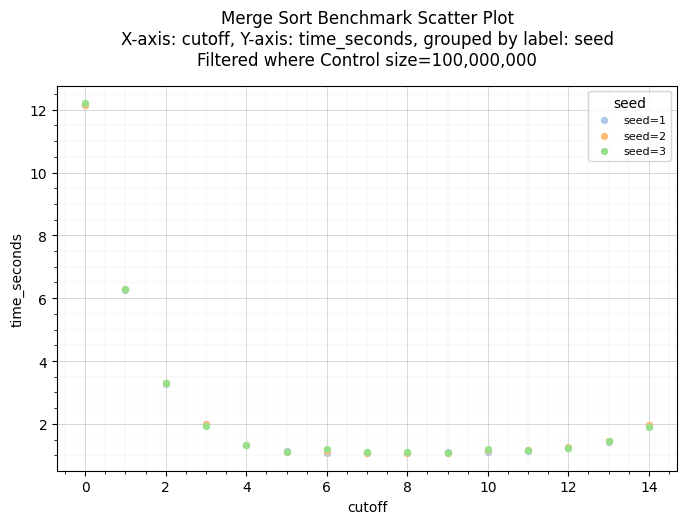
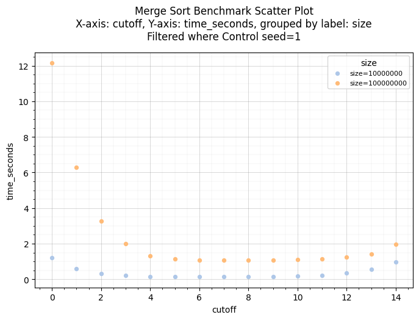
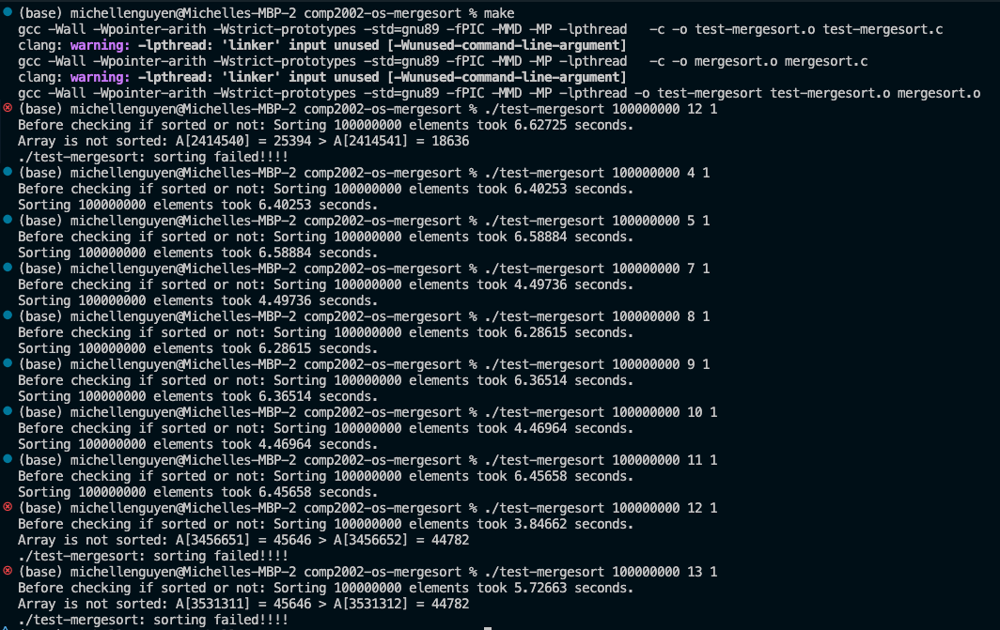
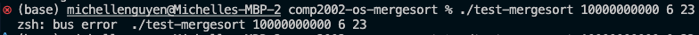

## Project: Parallel Merge Sort, Assignment 3, Group 89 

* Authors: Rory Long, Riley Turner, Michelle Nguyen
* Group name: UG_Group89

## Overview

This program implements parallel merge sort using the `pthread` library. 
It extends the original merge sort algorithm by creating multiple threads to sort subarrays in parallel, 
allowing faster sorting on multi-core systems. 

## Manifest

* `mergesort.c` - Has the functions to implement serial and parallel merge sort, including merge(), my_mergesort(), parallel_mergesort(), and buildArgs().

* `mergesort.h` – Header file defining global variables, functions, and the struct argument used for thread arguments.

* `test-mergesort.c` – Testing program that generates a random array and measures sorting performance.

## Building the project

### Required libraries/ software
1. `pthread` library
2. `gcc/clang` C compiler

### Building the project 
1. From the project folder `./comp2002-os-mergesort`, run: `make`. This will compile the code and produce the executable file `test-mergesort`.
2. Run the test: `./test-mergesort <input size> <cutoff level> <seed>`. Details on the input parameters are found in the [next section](#features-and-usage)

## Features and usage

### Program usage
To run the executeable use the format below:
`./test-mergesort <input size> <cutoff level> <seed>`

Input Parameters 
- `input size` – number of elements in the array
- `cutoff level` – maximum recursion level to create threads
- `seed` – seed for random array generation

### Summary of program main features
- When the `cutoff` is set to 0, the program uses standard recursive merge sort. The output shows the runtime of **single-threaded merge sort**.

- When the `cutoff` is greater than 0, the program creates threads up to the specified level (derived from `cutoff`) to sort subarrays concurrently. The output shows the runtime of **parallel merge sort**.

## Testing

### Running our test `.py` code
1. Make sure you are in our project folder `./comp2002-os-mergesort`
2. Create a new environment if you have not done so: `python -m venv ./test/.venv`
3. Activate `source ./test/.venv/bin/activate` (for MacOS/Linux) or `.\test\.venv\Scripts\activate` (Windows)
4. Use our requirements.txt to install dependencies: `pip install -r ./test/requirements.txt`
Our dependencies in requirements.txt include
* Pandas
* Matplotlib
5. (1) Run our first script to generate a csv, summarising the results of all runs: 
 `python ./test/create_test_csv.py`
    * Go to this script to adjust the inputs you want to run in the batch: inputs, cutoffs and seeds.
    * Output is a csv file with the name "results_{datetime}.csv" in the ./test/results folder.
6. (2.1) To see the table png of the result, run `python ./test/create_table.py`. This will run the latest created csv file. You can also change the csv file directly in this file.
7. (2.2) To see the scatter plot of the result, run `python ./test/create_plots.py`. 
* This will run the latest created csv file. 
* To select the control, edit this script.

### Record of our past testing results and discussion

**Graph 1:** 

Within the **first graph**, a clear correlation can be identified between cutoff quantity and the execution speed of the program.

- **_Cutoff 0 - 4_**: From cutoff 0 - 4 the execution time of the program decreases logarithmically as the parallel threads distribute the workload. The execution speed begins to plateau at a cutoff level of approximately 4.  

- **_Cutoff 4 - 11_**: From cutoff 4 - 11 the execution time of the program remains incredibly stagnant as the additional threads provide no significant improvement to the execution speed of the program. The number of threads is no longer the bottleneck of the process.

- **_Cutoff 11 - 14_**: From cutoff 11 - 14 the execution time of the program begins to increase steadily due to thread management overhead. With excessive threads relative to the number of available CPU cores, the overhead from context switching and thread coordination becomes a detriment to the programs speed, nullifying any benefit from the parallelism.

**Graph 2:** 

Within the **second graph**, a clear correlation can be identified between the size of the input array and the execution speed of the program.

- With an input array of size 100 000 000, the program initially requires an additional 10 seconds to execute when compared to the input array of size 10 000 000. This can be attributed to the lack of threading occurring within the program, and as the cutoff level increase so too does the efficiency of the program in both array sizes. 

- Once a cutoff level of 4 is achieved and the program begins to fully utilise the CPU cores without overusing them, both array sizes receive maximum benefit from the implemented parallelism. Both array sizes become compute-bound and scale as cutoff increases, with the rate of improvement remaining constant.

## Known Bugs

1. **Too large `cutoff` value**: When size = 100,000,000 and the cutoff value >=15, our program runs forever (not completed until after 10+ minutes and is forcibly shut down). 
    * With a cutoff of 15, at peak the process requires `2^(cutoff+1) - 1`=`2^16-1`= 65535 threads
    * The program tries to run thousands of threads on a CPU with only a handful of cores.
    * "Oversubscription": 
        * We may have too many open threads than CPU cores. On this machine, we have 60k threads on 8 scores. The OS will schedule the run so that each thread will get a tiny amount of time, then preempt it so the core can be used by other thread.
        * The OS constanlty saves and restores state, so there is a lot of context-switching overhead. This is also the reason why after a small cutoff, the runtime stops improving and then gets worse. 
        * The OS scheduler has to strugle managing a lot of equal-priority runable threads. Every thread runs a bit, but progress per thread is tiny, and thus the whole process just runs much more slowly.
    * Question for thought: Is the root cause "oversubscription" or "thread/resource starvation"?
        * Starvation means some threads never get CPU time; where as in oversubscription, every thread gets some CPU time but not sufficient to make any progress
        * One reason that leans towards oversubscription is that macOS, Windows use preemptive, round-robin politices for *equal-priority* threads. Our threads are at the same priority, and thus each runnable thread is given the same time. Because of too many threads, this time is exceedingly small.
    * Note: 
        * on Windows/Linux, the program does not return an error, it just runs for too long. 
        * However, on one of our group's MacOS machine of 8GB RAM, the program `./test-mergesort` only run successfully until cutoff value =11. 
        * Above 12, the `./test-mergesort` returns an error due to the array not being accurately sorted. 
        * The image below shows attempts at diagnosing this bug, by printing out the element that was not in the correct order:
        
        * On MacOS, this failure of pthread creation (due to too many new threads created) seems to be earlier than other machines. Every new thread gets its own stack reserved in virtual memory, and having `2^16-1` threads means that the process reserves much more than the allowed limit of macOS (at least for our 8GB RAM machine) . macOS seems to be much more conservative with the per-user thread limit. 

2. **Too large `size` value**: 
    * Run for too long: When size reaches = 1,000,000,000 (1 billion), the program runs for very long, until "forever". 
        * On the Mac 8GB machine: `./test-mergesort 1000000000 6 23`gives the output "Sorting 1000000000 elements took 106.77238 seconds." This is significant larger than the average of less than 2 seconds at 6 concurrent threads in previous test cases.
        * For an array of `int` (4 bytes per `int` element), and size = 1,000,000,000 (1 billion), memory just for `A` and `B` arrays is about 8 GB. This is the size of RAM on the test machine (macOS).
        * On an 8 GB Mac, this runs out of RAM. The OS now swaps pages back and forth from RAM and disk -> Heavy paging and thus the long runtime.(Thrashing now may occur when the system now spends more time on page swapping than actual processing.)
    * Bus error: When size reaches >= 10,000,000,000 (10 billion) and with a test case of cutoff = 6, the program returns a *bus error* (for Mac M1 8GB RAM machine). 
        * For size ≥ 10,000,000,000 (10 billion), A+B would need `2*4*10 billion` bytes. This might be much more than the what the virtual memory limit that a 8GB machine can handle. 
        * `malloc` may fail and return an invalid address. The code does not check for invalid address, and thus when we access this invalid address, there is a bus error. (which is a fault raised when the program accesses memory that CPU cannot handle, such as an invalid address). There is memory overflow.
        * At the time of testing, the input is far beyond the test machine’s memory/compute capacity.
    

## Reflection and Self Assessment

**Discuss the issues you encountered during development and testing**

_Development_:

- When the group initially began to construct a solution for this project, there was some confusion in relation to the usage of the `args` struct and its components. It wasn't immediately clear as to what the left and right pointers represented, but with some further research and testing this confusion quickly subsided.
- While developing the `merge` function, the group found that some iterators did not appropriately take into account their position relative to the end of the array. This caused several out-of-bounds errors that were quickly addressed.

_Testing_:

- The testing process initially lacked automation, requiring multiple manual executions for performance and correctness checks. To address this, a testing script was developed to streamline the process by automatically executing numerous variations of the main program, collating timing data, generating visualisations, and ensuring proper functionality in the most extreme cases.

**What problems did you have?**

- The group did not face any major issues throughout the course of this project, with the only minor issue being that of availability. Attempting to schedule a time for the group to communicate ideas and clarify expectations was the only real difficulty.

**What did you have to research and learn on your own?**

- Although the topic of merge sort is familiar, the group felt it necessary to do some minor revision on the core concepts and logic.
- The group needed to do some research in relation to the usage of threads to ensure the `parallel merge sort` function ran as anticipated.

**What kinds of errors did you get? How did you fix them?**

- The group ran into one minor issue in the development of the codebase, with that being in how some iterators did not appropriately take into account their position relative to the end of the array. To identify and fix this issue, a visualisation of the programming logic was produced and execution flow was tracked.

**What parts of the project did you find challenging?**

- Producing a testing script to more efficiently orchestrate testing was the most challenging aspect of this project. This was difficult because the script was required to be produced in such a way that it could execute many different variations of the main executable, collating the results and producing the relevant visualistion material.

**Is there anything that finally "clicked" for you in the process of working on this project?**

- Everything in this project functioned exactly as the group expected, there were no **eureka** moments unfortunately. One group member did express their satisfaction at the realisation a testing script could be produced to automate testing, this was the closest the group came to having a **eureka** moment.

**How well did the development and testing process go for you?**

- The developmental process was extremely efficient, with the entire programming portion of the project requiring the better part of an hour. The testing process was similarly expeditious, with testing requiring approximately two hours of dedicated efforts.

## Sources Used

1. Bus error: https://stackoverflow.com/questions/212466/what-is-a-bus-error-is-it-different-from-a-segmentation-fault
2. Parallel Merge sort: https://stanford.edu/~rezab/classes/cme323/S16/notes/Lecture04/cme323_lec4.pdf
3. Oversubscription: https://stackoverflow.com/questions/55544970/using-more-software-threads-than-cpus-oversubscribing
4. Oversubscription: https://dl.acm.org/doi/10.1145/3431379.3460641#:~:text=Traditional%20applications%20need%20to%20be,CPU%20elasticity%20in%20the%20cloud.

### For testing - Python script
1. Subprocess documentation: https://docs.python.org/3/library/subprocess.html
2. Python regex: https://www.w3schools.com/python/python_regex.asp
3. Create table from dataframe: https://stackoverflow.com/questions/26678467/export-a-pandas-dataframe-as-a-table-image
4. Some matplotlib references:
*  https://www.geeksforgeeks.org/python/plot-multiple-plots-in-matplotlib/
*  https://stackoverflow.com/questions/71968225/how-to-create-two-scatter-plots-in-subplots
